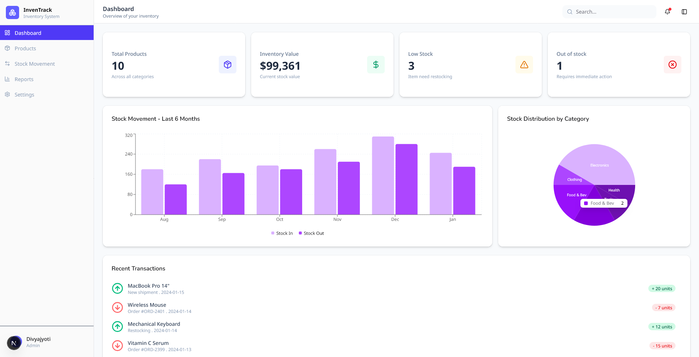
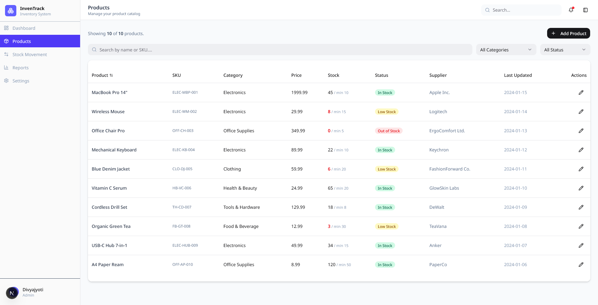
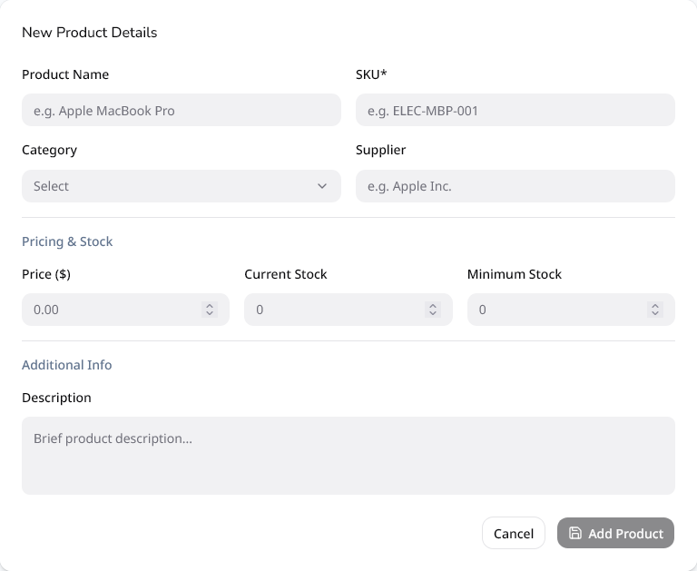
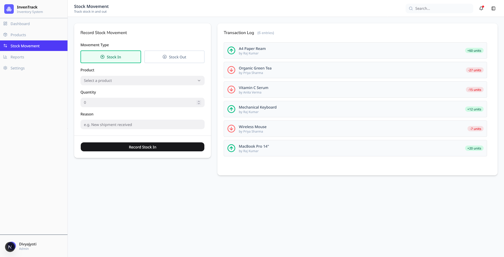

# InvenTrack — Inventory Management System

A responsive, production-ready frontend prototype for inventory management built with Next.js 16, TypeScript, ShadCN UI, and React Hook Form + Zod.

> Built as part of a frontend developer assignment. Demonstrates component architecture, form validation, data visualization, and modern React patterns.

---

## Screenshots

| Dashboard                                        | Product List                                   |
| ------------------------------------------------ | ---------------------------------------------- |
|  |  |

| Add Product                                          | Stock Movement                           |
| ---------------------------------------------------- | ---------------------------------------- |
|  |  |

---

## Features

- **Dashboard** — KPI stat cards, 6-month stock movement bar chart, category distribution pie chart, and recent transaction feed with ScrollArea
- **Product List** — Searchable, filterable table with real-time results count, stock status badges, and edit actions
- **Add / Edit Product** — Fully validated form using React Hook Form + Zod with field-level error messages and dirty state tracking
- **Stock In / Stock Out** — Toggle-based stock movement form with live transaction log that updates optimistically

---

## Tech Stack

| Category        | Technology                      |
| --------------- | ------------------------------- |
| Framework       | Next.js 16 (App Router)         |
| Language        | TypeScript                      |
| Styling         | Tailwind CSS                    |
| Components      | ShadCN UI (Radix UI primitives) |
| Form Management | React Hook Form                 |
| Validation      | Zod                             |
| Charts          | Recharts                        |
| Icons           | Lucide React                    |
| Notifications   | Sonner                          |
| Deployment      | Vercel                          |

---

## Project Structure

```
inventory-ms/
├── app/
│   ├── dashboard/          # Dashboard page + loading skeleton
│   ├── products/
│   │   ├── [id]/           # Edit product page (dynamic route)
│   │   └── new/            # Add product page
│   ├── stock/              # Stock In / Stock Out page
│   ├── layout.tsx          # Root layout with sidebar + header
│   └── not-found.tsx       # Global 404 page
├── components/
│   ├── layout/             # Sidebar, Header
│   ├── dashboard/          # StatCard, StockChart, RecentTransactions
│   ├── products/           # ProductTable, ProductFilters, ProductForm
│   ├── stock/              # StockForm, TransactionLog
│   └── ui/                 # ShadCN components
├── data/
│   └── products.ts         # Static dummy data (API-ready structure)
├── lib/
│   ├── utils.ts            # cn() utility
│   └── validators/
│       └── product.ts      # Zod schemas
└── types/
    └── index.ts            # Shared TypeScript interfaces
```

---

## Getting Started

### Prerequisites

- Node.js 18+
- npm or yarn

### Installation

```bash
# Clone the repository
git clone https://github.com/MahendraPawar/inventory_management_system.git

# Navigate into the project
cd inventory-ms

# Install dependencies
npm install

# Start the development server
npm run dev
```

Open [http://localhost:3000](http://localhost:3000) in your browser.

---

## Key Design Decisions

**Why Next.js over plain React?**
App Router gives file-based routing, React Server Components, and convention-based loading states out of the box. The `/dashboard`, `/products`, and `/stock` routes map directly to folders with no router configuration needed.

**Why ShadCN UI?**
Unlike MUI or Chakra, ShadCN copies components directly into the codebase. This means full customization control without being locked into a third-party design system's update cycle.

**Why React Hook Form + Zod?**
RHF avoids re-renders on every keystroke — form state is uncontrolled under the hood. Zod schemas serve as both runtime validation and compile-time TypeScript types via `z.infer<>`, making the schema a single source of truth.

**Server vs Client Components**
Pages that only read static data are Server Components. Components using `useState`, `usePathname`, or browser APIs (charts, filters, forms) are marked `"use client"`. This follows the Next.js App Router best practice of pushing client boundaries as deep as possible.

**Separation of Concerns**
Dummy data lives in `data/products.ts` isolated from UI components. Replacing it with real API calls requires changes to only one file.

---

## Connecting a Real Backend

The project is structured to make API integration straightforward:

```ts
// Current — static data
import { products } from "@/data/products";

// Future — API call (no component changes needed)
const products = await fetch("/api/products").then((res) => res.json());
```

For full-stack integration the recommended additions would be:

- **Supabase** or **PostgreSQL** for the database
- **Next.js Route Handlers** (`app/api/`) for the API layer
- **Drizzle ORM** or **Prisma** for type-safe database queries
- **NextAuth.js** for authentication

---

## What I Would Add With More Time

- Pagination on the product table for large datasets
- Bulk stock operations (select multiple products)
- Export to CSV functionality
- Role-based access control (Admin vs Viewer)
- Unit tests with Jest + React Testing Library
- E2E tests with Playwright

---

## Author

**Mahendra Pawar**
Full Stack Developer — React · Next.js · TypeScript · Node.js

🔗 [LinkedIn](#) &nbsp;|&nbsp; 🐙 [GitHub](https://github.com/Mahi24-prog) &nbsp;|&nbsp; 📧 mahendrapawar444666@gmail.com
